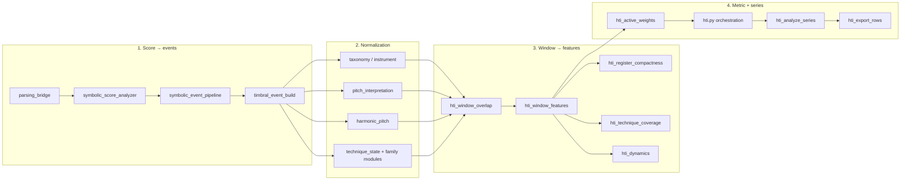

# H_TI symbolic pipeline — stage → module map

Before **H_TI_core** is computed, the score passes through a **symbolic preparation pipeline**. Each stage has a dedicated module so changes to one concern (e.g. pitch interpretation) do not silently affect unrelated exports.

This document is the maintainer map. End users should start from [Product scope](PRODUCT_SCOPE.md) and [Onboarding (H_TI)](ONBOARDING_H_TI.md).

## Pipeline overview

## Stage 1 — Symbolic extraction (score → event list)

| Concern | Module |
|---------|--------|
| Parse MusicXML/MIDI | `parsing_bridge.py` |
| Score holder + time axis | `symbolic_score_analyzer.py` — `SymbolicScoreAnalyzer` |
| Walk score, assemble event list | `symbolic_event_pipeline.py` — `build_symbolic_score_events` |
| Instrument / family names | `symbolic_instrument_resolve.py` + `taxonomy/instrument_taxonomy.py` |
| Sounding vs written pitch, transposition | `symbolic_pitch_resolve.py`, `pitch_interpretation.py`, `timbral_sounding_pitch.py` |
| Harmonic / natural pitch policy | `harmonic_pitch.py` (via pitch resolve) |
| Technique state per family | `technique_state.py`, `*_technique.py`, `notation_context.py` |
| Assemble one event dict | `timbral_event_build.py` — `build_symbolic_score_event` |
| Percussion pitched/unpitched | `percussion_ontology.py` |
| H_timbral metric on events (legacy) | `timbral.py` — `extract_timbral_features`, `analyze_timbral` |

**Contract:** `SymbolicTIHomogeneityAnalyzer` and `TimbralHomogeneityAnalyzer` both inherit `SymbolicScoreAnalyzer`, which calls `build_symbolic_score_events`. H_TI does **not** subclass `timbral.py`.

## Stage 2 — Window overlap

| Concern | Module |
|---------|--------|
| Event active in `[t_start, t_end)` | `hti_window_overlap.py` — `is_event_active_in_window` (also `SymbolicScoreAnalyzer._active_in_window`) |
| Overlap mass per event | `hti_window_overlap.py` — `event_overlap_ql`, `build_window_contrib` |

## Stage 3 — Per-window features (inputs to H_TI_core)

| Concern | Module |
|---------|--------|
| Herfindahl on instrument / subfamily / macrofamily | `hti_window_features.py` + `hti_concentration.py` |
| Technique uniformity + coverage | `hti_technique_coverage.py` |
| Register compactness (span + pairwise semitones) | `hti_register_compactness.py` |
| Notated dynamics aggregates | `hti_dynamics.py` |
| Dominant shares / ties | `dominant_distribution.py` |

**Entry point:** `extract_hti_window_features()` in `hti_window_features.py`.  
**Class wrapper:** `SymbolicTIHomogeneityAnalyzer.extract_hti_window()` in `hti.py`.

## Stage 4 — H_TI_core and time series

| Concern | Module |
|---------|--------|
| Weighted geometric mean (**H_TI_core**) | `hti_active_weights.py` — `compute_hti_active_components` |
| Subfamily relief, strict vs relieved | `hti.py` — `compute_H_TI`, `analyze_hti` loop |
| Adaptive window geometry | `hti_adaptive_windows.py` |
| Comparability fingerprint | `hti_comparability.py` |
| Optional affinity / blend / acoustic proxy | `hti_analyze_series.py`, `timbral_affinity.py`, `symbolic_blend_layers.py`, `timbral_acoustic_proxy.py` |
| CSV/JSON column registry | `hti_export_rows.py` |
| Measure lookup for exports | `hti_score_lookup.py` |

**Orchestration only:** `hti.py` (~200 lines) — constructor, thin delegates, `analyze_hti` loop.

## What belongs in `hti.py` vs elsewhere

| Keep in `hti.py` | Do **not** add to `hti.py` |
|------------------|------------------------------|
| `SymbolicTIHomogeneityAnalyzer` public API | Register math → `hti_register_compactness.py` |
| `analyze_hti` window loop | Window mass aggregation → `hti_window_features.py` |
| `compute_H_TI` delegate | Technique coverage rules → `hti_technique_coverage.py` |
| Backward-compatible re-exports | Event building → `symbolic_event_pipeline.py` / `timbral_event_build.build_symbolic_score_event` |

## Optional layers (orthogonal to H_TI_core)

See [Product scope — Tier 2](PRODUCT_SCOPE.md). Enabled via analyzer flags; appended in `hti_analyze_series.py`, not in `hti_window_features.py`.
