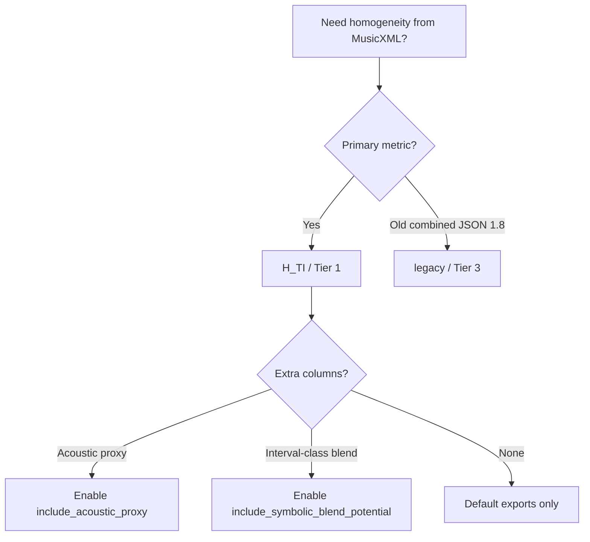

# Product scope — what to use and what to ignore

This page separates **primary product code** from **optional research layers** and **legacy multimetric paths** so third parties do not accidentally treat internal modules as the default API.

## Tier 1 — primary product (H_TI)

| Surface | Role |
|---------|------|
| Gradio tab **H_TI** | Default user path |
| `SymbolicTIHomogeneityAnalyzer` (`analyzers/hti.py`) | Core analyzer (orchestration; helpers in `hti_*` modules) |
| `symbolic_event_pipeline.py` | Score → symbolic events (shared with H_timbral path) |
| `services/analysis_service_hti.py` | Service entry for H_TI runs |
| H_TI JSON `schema_version` **3.0** | Canonical export |
| `HTI_CSV_COLUMNS` (`hti_export_rows.py`) | Canonical CSV |

Start here: [Onboarding (H_TI path)](ONBOARDING_H_TI.md).

## Tier 2 — optional layers (off by default)

These extend H_TI exports when explicitly enabled on the analyzer or in batch scripts. They are **orthogonal** to `H_TI_core` and do not change the default weighted sum unless you opt in.

| Layer | Flag / module | Doc |
|-------|----------------|-----|
| Timbral affinity (literature relief) | always computed in full pipeline; relief factors configurable | Technical manual § affinity |
| Symbolic blend / interval-class | `include_symbolic_blend_potential=True` | [Symbolic interval-class layer](SYMBOLIC_INTERVAL_CLASS_LAYER.md) |
| H_TA acoustic proxy | `include_acoustic_proxy=False` (default) | [H_TA acoustic proxy](H_TA_ACOUSTIC_PROXY.md) |

**Rule:** If a column or JSON field comes from Tier 2, check the corresponding flag before comparing scores across studies.

## Tier 3 — legacy multimetric (research / JSON 1.8)

| Metric | Package |
|--------|---------|
| H(t), H_cluster, H_orchestration_symbolic, U(t), fusion heuristics | `homogeneity_analyser.legacy` |
| Combined export | JSON `schema_version` **1.8** |
| Gradio tabs (non–H_TI) | `ui/callbacks_legacy.py` |

See repo root [LEGACY.md](../LEGACY.md). Pytest marks these modules `@pytest.mark.legacy`; day-to-day CI uses `pytest -m "not legacy"`.

## Tier 4 — internal design corpus (not product API)

| Path | Purpose |
|------|---------|
| `docs/H_TIMBRAL_*.md` | Instrument-family design notes for timbral affinity rules |
| `docs/archive_legacy/` | Historical sanitation / schema **2.9** reports |
| `docs/H_TIMBRAL_DESIGN_INDEX.md` | Index into the H_TIMBRAL corpus |

These files support maintainers and literature audits; they are excluded from the default MkDocs build (`exclude_docs` in `mkdocs.yml`) but indexed for navigation under **Internal design**.

## Quick decision tree

